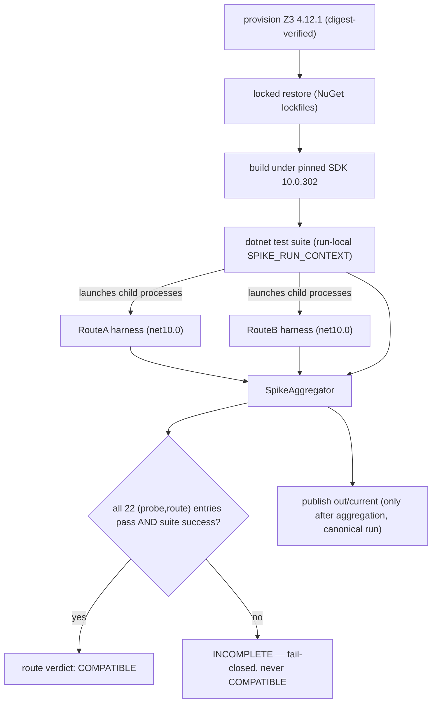

# Feature: .NET 10 / Dafny 4.11.0 Package-Compatibility Spike

> **Phase 0.0, bullets 1–3.** Permanent, non-production conformance infrastructure.
>
> - Spec: [`.correctless/specs/dafny-compat-spike.md`](../../.correctless/specs/dafny-compat-spike.md)
> - ADR: [`ADR-0001-dafny-integration-boundary.md`](../adr/ADR-0001-dafny-integration-boundary.md)
> - Verification: [`dafny-compat-spike-verification.md`](../../.correctless/verification/dafny-compat-spike-verification.md)
> - Operator surface: [`spikes/dafny-compat/README.md`](../../spikes/dafny-compat/README.md)

## What this validated

The entire Corrected architecture (DESIGN.md §12) rests on one unproven assumption:
that Dafny 4.11.0's `net8.0` NuGet assemblies (`DafnyCore`, `DafnyPipeline`, …) work
**in-process on a .NET 10 host** for the real APIs the worker needs — parse, resolve,
verify via Boogie + native Z3, and resolved-AST recovery. NuGet *computes* that
compatibility; nobody had *proven* it (no surveyed third-party tool embeds these
packages from NuGet — the ecosystem vendors source or shells out). DESIGN.md gates all
of Phase 0.1 on this spike and permits rejecting the in-process boundary *only* with a
reproduced integration failure.

This spike builds a tracked, permanent harness under `spikes/dafny-compat/` that produces
**evidence + ADR-0001**, not production code (`src/` stays empty). Its result: **both
integration routes are COMPATIBLE**, suite-attested (274/274 tests green,
`final_suite_status = success`).

| Route | How it verifies | Loads |
|-------|-----------------|-------|
| **A** | `CliCompilation` via `DafnyDriver` (the `dafny` CLI path) | `DafnyDriver` + `DafnyCore` + **`DafnyLanguageServer`**; `DafnyPipeline` *not* loaded |
| **B** | hand-assembled `Compilation` from `DafnyCore` + `DafnyPipeline` + `Boogie.ExecutionEngine` | no `DafnyDriver`, no `DafnyLanguageServer`; `DafnyPipeline` loads only via the OQ-004 standard-libraries `.doo` consumption |

**Route A is the selected boundary** — chosen for fidelity to the `dafny` CLI's own
verification path and for upgrade robustness (Route B's `DafnyPipeline` consumption is
load-bearing and would need re-validation on every Dafny bump). The accepted cost is that
`DafnyLanguageServer` becomes a permanent, un-trimmable part of the production closure
(the driver's parser/resolver/verifier *are* LanguageServer types). Formal ADR promotion
(provisional → accepted) and the DD-007 component-table propagation are deferred to the
final Phase 0.0 feature (DF-002); `ADR-0001` deliberately still reads
`boundary_decision: pending` until that promotion lands with a schema-valid adjudication
record.

## How to run it

The canonical entry point is the bootstrap controller `scripts/run-spike.sh`. It must be
invoked **hardened** — PRH-004 refuses an unhardened invocation with exit 30:

```bash
env -i HOME="$HOME" bash -p spikes/dafny-compat/scripts/run-spike.sh
```

A canonical run (~13–15 min) mints a `run_id`, provisions Z3, does a locked restore +
build under the pinned SDK, runs the `dotnet test` suite with `SPIKE_RUN_CONTEXT` set
(bound to a run-local settings file, **not** `out/current`), aggregates, prints a per-route
terminal verdict summary (no JSON parsing needed), and **only then** publishes
`out/current` — a run aborted before aggregation leaves the pointer untouched (bug-#3 fix).

Running the suite directly (`cd spikes/dafny-compat && dotnet test DafnyCompatSpike.sln
-noAutoResponse`) requires a prior **canonical** controller run to have published
`out/current` — integration tests refuse to launch outside a controller run context and
fail loudly with a remediation message otherwise. A bare `dotnet test spikes/dafny-compat`
from the repo root is **not** a reliable gate: it binds to whatever last published
`out/current` and bypasses the pinned SDK (run from *inside* `spikes/dafny-compat/` so
`global.json` governs — MA-UX-6). See verification finding F-01.

## Pipeline & verdict



The bootstrap controller (`run-spike.sh`) — the first thing that runs — holds the single
absolute monotonic deadline (`/proc/uptime`) from run mint through final aggregation, and
emits nonce-bound restore/build receipts. The **aggregator** derives its expected report
set from the committed probe manifest's route plan (never from reports found on disk — the
natural fail-open shape), owns the shared probes, and binds every consumed report to the
current `run_id` so a stale report from a crashed prior run can never be aggregated.

## Probe manifest & evidence

The mandatory probe set and route plan are **spec-owned**: committed as a versioned
manifest whose SHA-256 is a hard-coded test constant, asserted against both the manifest
file and every evidence report — so removing/altering a probe or route requires a
three-point change (spec + manifest + test constant). A full run's expected completed set
is exactly **22 composite-keyed `(probeID, route)` entries**: 9 child probes × 2 routes +
2 controller-attested P01 instances + 2 shared probes (P02 build-identity, P04
solver-identity).

Probes span restore identity (P01), SDK build identity (P02), loaded-assembly + runtime
identity (P03), solver identity (P04), solver-path-honored via a nonce sentinel (P05),
verify-ok non-vacuously (P06), verify-bad refutation at the planted location (P07),
staged/typed frontend failures (P08 parse, P09 resolve), resolved-AST recovery (P10),
options-manifest readback with a normalization canary (P11), and closure recovery (P12).

Evidence is a machine-readable JSON report under a **committed, versioned schema** whose
digest is validated before any report is parsed. Every field is partitioned into three
classes: **(1) binding/environment identity** (`run_id`, git commit, RIDs, SDK/runtime
versions, loaded-assembly paths — recorded but excluded from cross-run equality),
**(2) deterministic outcome projection** (per-route verdicts, per-probe results, node
table, digests, resolved versions, executed-solver SHA-256 — *the equality domain*), and
**(3) volatile** (timestamps, durations). Determinism (INV-010) is a run-twice-and-diff on
class 2. Committed samples come as a **pair**: a variance-mode sample (full class-2
equality) and a canonical-run sample (equality masks only the schema-declared suite-status
subtree); ADR-0001's verdict citations use the canonical sample. Both regenerate only via
`scripts/regen-sample.sh`, which refuses a dirty tree.

## Toolchain pins (TB-004: inbound toolchain supply chain)

Every toolchain artifact is exact-pinned and digest-verified before use; intake failure is
fail-closed (no verdict, never a silent fallback to ambient resolution).

- **Dafny stack**: `DafnyCore` / `DafnyPipeline` / `DafnyDriver` `[4.11.0]`,
  `Boogie.ExecutionEngine` `[3.5.5]`, `System.CommandLine` `[2.0.0-beta4.22272.1]`
  (central transitive pin; no spike source uses its API) — locked-mode NuGet restore under
  a `<clear/>`-scoped single-source config, CPM-authoritative.
- **Solver**: Z3 4.12.1, SHA-256-pinned release asset, installed outside ambient discovery
  locations; `executed_solver_sha256` re-verified against the provisioning digest by P04.
- **SDK**: .NET `10.0.302` pinned via `global.json` (`rollForward: disable`,
  `allowPrerelease: false`).
- **net8 control**: `8.0.29` (the BND-004 / INV-013 three-cell net8-vs-net10 experiment).
- **RID**: `linux-x64` only — the sole RID this spike proves. `osx-arm64` / `win-x64` fail
  closed at provisioning.

Changing any pinned identity requires re-running the suite, committing the evidence diff,
and amending ADR-0001 (DD-006).

## Known limitations & residuals

- **F-01 (MEDIUM)** — the configured `commands.test` is not a reliable green gate; only the
  canonical `run-spike.sh` path produces the attested green. Documented here and in
  AGENT_CONTEXT; the config change is deferred and tracked with CI wiring (DF-001).
- **F-02 (LOW)** — committed evidence samples carry a `git_commit_id` behind HEAD; this is
  class-1 binding, excluded from equality by INV-009, and the fresh-run-equality test
  passes. A sample-regeneration item, non-blocking.
- **Deferred obligations** — DF-001 (wire the CI stub `ci/spike-ci.yml` as a permanent
  job), DF-002 (promote ADR-0001 provisional → accepted + component-table propagation),
  and DF-003..DF-012 (MEDIUM/LOW items in `.correctless/meta/deferred-findings.json`). None
  gate the spike.
- **Residuals** (ADR-0001 standing list) — nuget.org is an accepted bootstrap-TCB;
  permanent availability dependency on the pinned nuget packages, Z3 release asset, and
  .NET runtime archive (vendoring rejected for the spike); the EA-003 offline-verification
  expectation is unverified; sentinel and real solver runs are separate invocations
  (composition is inductive).

## Scope boundary

In scope: DESIGN.md Phase 0.0 bullets 1–3 (route-isolated harness + locks, digest-verified
Z3 provisioning + execution proof, in-process parse/resolve/Z3-verify of committed
fixtures, resolved-AST recovery, schema-versioned evidence + aggregator + ADR, operator
surface, TB-004). Out of scope (later Phase 0.0 features): editable-proof erasure /
planted-bypass rejection, fingerprint determinism, CLI-vs-adapter differential, Z3
resource-count determinism, persistent search-verifier reuse, the JSONL protocol
prototype, Pi adapter modes, release distribution, and the full mutation corpus. The
production `DafnyAdapter` is written fresh in Phase 0.1, informed by ADR-0001.
