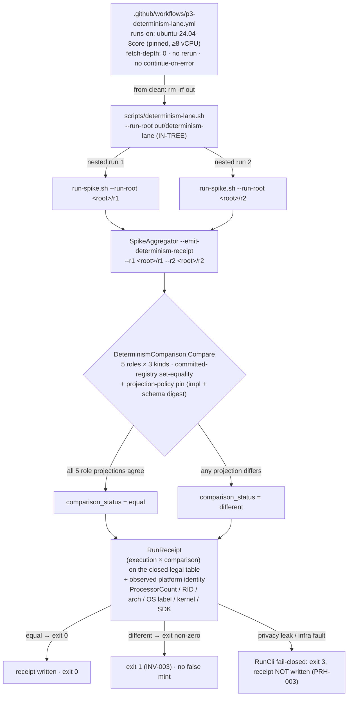

# Feature: P3 Determinism Attestation — PR1 (Group A)

> **Spec:** [`.correctless/specs/p3-determinism-attestation.md`](../../.correctless/specs/p3-determinism-attestation.md)
> **Status:** PR1 of a **3-PR arc**. **P3 stays `false` and `implementation_readiness`
> stays BLOCKED** — PR1 signs nothing and flips no readiness precondition. Non-production
> (spike-side) infrastructure under `spikes/dafny-compat/`.

## What it does

The Phase-0.0 determinism check (Inv010) proves a single spike run's evidence projects
deterministically. This feature turns that into a **tamper-evident, CI-attested capability
baseline** that the readiness gate will eventually carry as a real fail-closed **P3** probe
(replacing the `validator-deferred` stub). It lands in three PRs:

- **PR1 (this branch, Group A):** the spike-side determinism **status model**, the dedicated
  **serial CI lane**, and a commit-anchored **measurement campaign** scaffold. P3 stays false.
- **PR2:** the frozen `Corrected.Provenance` signing/verification mechanism (cosign, DSSE) +
  `TB-007` registration. P3 stays false.
- **PR3:** evidence-only activation — P3 flips `true`, but readiness stays BLOCKED until P2.

PR1's job is to make "the determinism check **actually runs** in an isolated CI lane" and to
emit a structured **RunReceipt** binding the observed platform identity to a derived
`(execution × comparison)` status pair on a **closed legal table** — never a false
`COMPATIBLE`/mint on an infrastructure fault.

## How the lane works



The receipt uses a **three-artifact model** — `RunnerInvocationOutcome` (execution) →
`RunReceipt` (execution × comparison + platform identity) → `AttestedRunReceipt` (PR2/PR3, the
signed subject). `comparison_status = equal` **iff** every one of the **5 roles**
(`run`, `route-a`, `route-b`, `control-a`, `control-b`) projects identically across the two runs
under the committed projection policy; the **3 schema kinds** (`run-report`, `route-report`,
`control-report`) and roles are loaded from committed registries and asserted **set-equal** (no
vacuous `∀`).

## Invariants covered (Group A)

| Rule | What PR1 guarantees |
|------|---------------------|
| **INV-001** | Total, fail-closed status classifier — never `different`/mint on an unknown or off-table pair; the shipped `Build` mapping is single-sourced through `DeterminismClassifier.Classify`; the legal `(execution × comparison)` table is derived from committed `legal-status-table.json`, not a test literal. |
| **INV-002** | `Compare` runs all 6 ordered checks incl. committed-registry role/kind set-equality and the projection-policy pin (impl digest + `Sha256File(evidence-schema.json)`). |
| **INV-003** | `different` → exit non-zero, `NotAttempted`, observation-scoped message; `equal` is the only mint-eligible cell. |
| **INV-004** | From-clean subset: `plan_commit` ancestry via real `git merge-base`, attempt-1, single-sourced core floor (`resource-floor.json`, `core_floor = 8`), below-floor → `resource_floor_skipped`. |
| **INV-005** | Dedicated serial lane records the observed platform identity of the emitting host (pinned OS label, never floating `-latest`). |
| **PRH-003** | `ReceiptPrivacyScan` wired **fail-closed into `DeterminismReceiptWriter.RunCli`** — a local-identity leak → exit 3, receipt not written. |
| **PRH-004** | From-clean guard: P3 stays `false` / readiness BLOCKED. |
| **PRH-005** | PR1 signs nothing; no retry / `continue-on-error` in the lane; the run root must be **in-tree** so the recorded build argv stays free of absolute host paths. |

### CI separation

The heavyweight lane tests carry `[Trait("Category","determinism-lane")]`. The 4-vCPU **general**
gate (`dafny-compat-spike.yml`) passes `run-spike.sh --exclude-category determinism-lane` (below
the 8-core floor they throw a loud typed skip), and the **dedicated ≥8-core lane**
(`p3-determinism-lane.yml`) runs them for real. A no-arg local run (≥8 cores) runs every category.

### Run-root boundary (BLOCKING-1 fix)

The lane run root **must live within the spike tree** so `SpikeRunRootRel` stays SPIKE-relative
(`Directory.Build.props`). An out-of-tree root (e.g. `$RUNNER_TEMP`) makes MSBuild write build
outputs in-tree while the DD-008 completeness check resolves the true absolute root — a silent
INCOMPLETE — and would leak an absolute host path into the recorded build argv (PRH-005). Both
`run-spike.sh` and `determinism-lane.sh` each carry a **single-sourced `ensure_in_tree_run_root`
guard** that creates and canonicalizes the root, **refuses an out-of-tree `--run-root` fail-closed**
before any build, and `rm -d`s the just-created empty dir on refusal so nothing is orphaned
(RLT-1/AUDIT-ARCH-1). `Pr1RunRootBoundaryTests` exercises the real scripts with an out-of-tree
root in the general from-clean gate, asserting both the refusal and the no-orphan cleanup.

### Sentinel invocation measure (route-b determinism fix)

`deterministic.sentinel_ledger_outcomes.invocations_for_this_nonce` records **how many
distinct sentinel probe-legs fired the real binary** for the run's nonce — **not** the raw
ledger entry count. The P05 anti-spoof probe verifies against a recording z3 stub that dies
mid-protocol by design; Boogie then restarts the "crashed" prover a **timing-dependent**
number of times, and each restart appends another entry under that probe's single sub-nonce
tag. The raw count therefore flapped (the P3 lane caught `route-b` at `2` vs `1`, flipping the
route-b projection SHA → `comparison_status = different`). The exact restart count is
prover-retry noise, not a compatibility claim — P05's own invariant is `delta ≥ 1`
(count-insensitive). The receipt derives the field from `HarnessCore.DistinctInvokedNonceTagCount`
— the count of **this run's own** stub tags (one per sentinel probe) that carry ≥1 entry —
which collapses restarts to a structural count and is stable across timing. Scoping to the
run's own tags is load-bearing: route-a and route-b **share one ledger under one nonce** in a
run root, so an unscoped tag count would let a role borrow a sibling's invocation (route-b would
read 2 = its own + route-a's, order-dependent). The **append-only ledger and its MA-RB-3 no-drop
armor are untouched** — only
the emit-time derivation changed; `decoy_invocations` and `invocations_for_foreign_nonces_counted`
(the real spoof/contamination signals) remain exact counts. Covered by
`Pr1SentinelInvocationDeterminismTests` (restart-multiplicity invariance, distinct-leg scaling,
foreign-nonce exclusion).

## How to run

```bash
# Full spike suite incl. the lane tests (requires ≥8 cores for the lane; canonical gate):
env -i HOME="$HOME" bash -p spikes/dafny-compat/scripts/run-spike.sh

# The determinism lane directly (two nested runs → receipt), in-tree run root:
cd spikes/dafny-compat
env -i HOME="$HOME" bash -p scripts/determinism-lane.sh --run-root out/determinism-lane
# → out/determinism-lane/receipts/determinism-receipt.json ; exit non-zero on `different`
```

In CI the lane runs automatically on the pinned `ubuntu-24.04-8core` runner
(`.github/workflows/p3-determinism-lane.yml`) on relevant changes.

## Configuration

Committed manifests under `spikes/dafny-compat/manifest/determinism/`:

| File | Role |
|------|------|
| `legal-status-table.json` | The closed legal `(execution × comparison)` table (INV-001). |
| `role-registry.json` / `schema-kind-registry.json` | The 5 roles / 3 schema kinds (set-equality). |
| `projection-policy-map.json` | Projection policy + pinned impl digest + schema digest (INV-002). |
| `resource-floor.json` | `core_floor = 8` (INV-004). |
| `campaign-rows.json` | Commit-anchored measurement campaign rows (see Known Limitations). |

## Known limitations

- **P3 stays `false`; readiness stays BLOCKED.** PR1 signs nothing and flips no precondition.
- **Measurement campaign run_ids are placeholders** (`PENDING-CI-NETWORK-ASSOCIATION-*`, QA-003 /
  RS-016 CI-network deferral). Replacing them with **real floor-capable serial-lane run_ids is a
  HARD pre-landing requirement** before this PR merges.
- **Deferred hardening (mini-audit round 1, PR1 not a current fail-open):** the Tier-1 findings
  were fixed on this branch; the Tier 2–4 items — lane launcher timeout (MA-RB-2), lane
  required-check / runner-existence (MA-ID-001), production-side resource-floor enforcement
  (MA-RB-1), `different`-branch executing coverage (MA-ID-002), parse pair-legality &
  `ValidateReport` before projecting (MA-HI-001/002/003), and receipt-evolution seams — are
  tracked in [`deferred-findings.json`](../../.correctless/meta/deferred-findings.json) as
  `DF-013…DF-029` for PR2/PR3.
