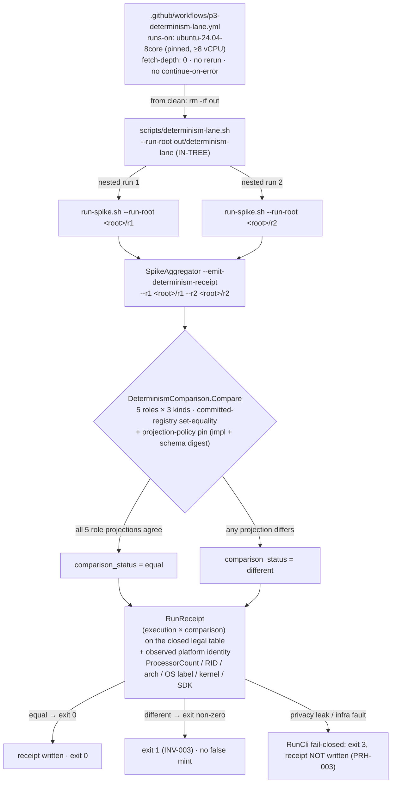
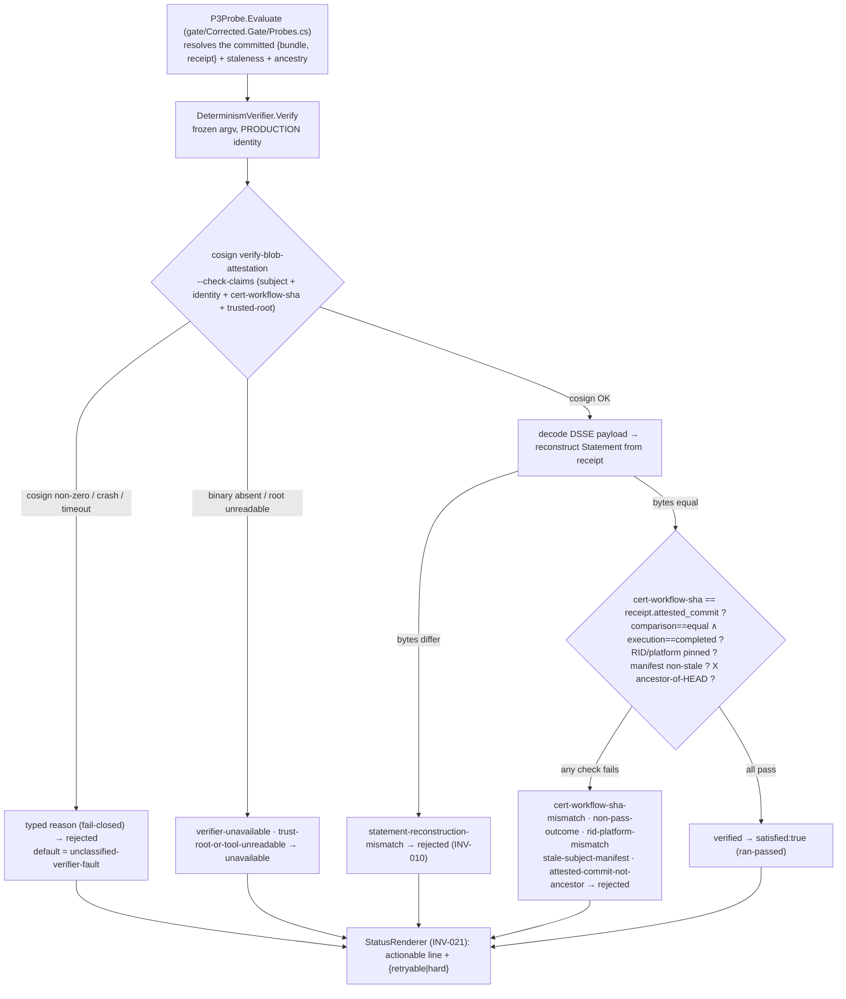

# Feature: P3 Determinism Attestation — PR1 (Group A) + PR2 (provenance mechanism + Group G)

> **Spec:** [`.correctless/specs/p3-determinism-attestation.md`](../../.correctless/specs/p3-determinism-attestation.md)
> **Status:** **PR1 and PR2 have both landed** on this branch, out of a **3-PR arc**. **P3
> stays `false` and `implementation_readiness` stays BLOCKED.** PR1 is spike-side infrastructure
> under `spikes/dafny-compat/`. PR2 adds the frozen `gate/Corrected.Provenance/` signing and
> verification mechanism, the live P3 verify/render layer, and the Group G entry-receipt
> lifecycle under `gate/`. PR2 signs no **production**-identity bundle and flips no readiness
> precondition — that evidence step is PR3.

## What it does

The Phase-0.0 determinism check (Inv010) proves a single spike run's evidence projects
deterministically. This feature turns that into a **tamper-evident, CI-attested capability
baseline** that the readiness gate will eventually carry as a real fail-closed **P3** probe
(replacing the `validator-deferred` stub). It lands in three PRs:

- **PR1 (Group A):** the spike-side determinism **status model**, the dedicated
  **serial CI lane**, and a commit-anchored **measurement campaign** scaffold. P3 stays false.
- **PR2 (this branch, Groups B/C/D/F/G — landed):** the frozen `gate/Corrected.Provenance/`
  signing and verification mechanism (cosign, DSSE, in-toto), the **live** P3 verify/render
  layer, the Group G entry-receipt lifecycle, and `TB-007` registration. P3 stays false.
- **PR3:** evidence-only activation — P3 flips `true`, but readiness stays BLOCKED until P2.

PR1's job is to make "the determinism check **actually runs** in an isolated CI lane" and to
emit a structured **RunReceipt** binding the observed platform identity to a derived
`(execution × comparison)` status pair on a **closed legal table** — never a false
`COMPATIBLE`/mint on an infrastructure fault.

## How the lane works



The receipt uses a **three-artifact model** — `RunnerInvocationOutcome` (execution) →
`RunReceipt` (execution × comparison + platform identity) → `AttestedRunReceipt` (PR2/PR3, the
signed subject). `comparison_status = equal` **iff** every one of the **5 roles**
(`run`, `route-a`, `route-b`, `control-a`, `control-b`) projects identically across the two runs
under the committed projection policy; the **3 schema kinds** (`run-report`, `route-report`,
`control-report`) and roles are loaded from committed registries and asserted **set-equal** (no
vacuous `∀`).

## Invariants covered (Group A)

| Rule | What PR1 guarantees |
|------|---------------------|
| **INV-001** | Total, fail-closed status classifier — never `different`/mint on an unknown or off-table pair; the shipped `Build` mapping is single-sourced through `DeterminismClassifier.Classify`; the legal `(execution × comparison)` table is derived from committed `legal-status-table.json`, not a test literal. |
| **INV-002** | `Compare` runs all 6 ordered checks incl. committed-registry role/kind set-equality and the projection-policy pin (impl digest + `Sha256File(evidence-schema.json)`). |
| **INV-003** | `different` → exit non-zero, `NotAttempted`, observation-scoped message; `equal` is the only mint-eligible cell. |
| **INV-004** | From-clean subset: `plan_commit` ancestry via real `git merge-base`, attempt-1, single-sourced core floor (`resource-floor.json`, `core_floor = 8`), below-floor → `resource_floor_skipped`. |
| **INV-005** | Dedicated serial lane records the observed platform identity of the emitting host (pinned OS label, never floating `-latest`). |
| **PRH-003** | `ReceiptPrivacyScan` wired **fail-closed into `DeterminismReceiptWriter.RunCli`** — a local-identity leak → exit 3, receipt not written. |
| **PRH-004** | From-clean guard: P3 stays `false` / readiness BLOCKED. |
| **PRH-005** | PR1 signs nothing; no retry / `continue-on-error` in the lane; the run root must be **in-tree** so the recorded build argv stays free of absolute host paths. |

### CI separation

The heavyweight lane tests carry `[Trait("Category","determinism-lane")]`. The 4-vCPU **general**
gate (`dafny-compat-spike.yml`) passes `run-spike.sh --exclude-category determinism-lane` (below
the 8-core floor they throw a loud typed skip), and the **dedicated ≥8-core lane**
(`p3-determinism-lane.yml`) runs them for real. A no-arg local run (≥8 cores) runs every category.

### Run-root boundary (BLOCKING-1 fix)

The lane run root **must live within the spike tree** so `SpikeRunRootRel` stays SPIKE-relative
(`Directory.Build.props`). An out-of-tree root (e.g. `$RUNNER_TEMP`) makes MSBuild write build
outputs in-tree while the DD-008 completeness check resolves the true absolute root — a silent
INCOMPLETE — and would leak an absolute host path into the recorded build argv (PRH-005). Both
`run-spike.sh` and `determinism-lane.sh` each carry a **single-sourced `ensure_in_tree_run_root`
guard** that creates and canonicalizes the root, **refuses an out-of-tree `--run-root` fail-closed**
before any build, and `rm -d`s the just-created empty dir on refusal so nothing is orphaned
(RLT-1/AUDIT-ARCH-1). `Pr1RunRootBoundaryTests` exercises the real scripts with an out-of-tree
root in the general from-clean gate, asserting both the refusal and the no-orphan cleanup.

### Sentinel invocation measure (route-b determinism fix)

`deterministic.sentinel_ledger_outcomes.invocations_for_this_nonce` records **how many
distinct sentinel probe-legs fired the real binary** for the run's nonce — **not** the raw
ledger entry count. The P05 anti-spoof probe verifies against a recording z3 stub that dies
mid-protocol by design; Boogie then restarts the "crashed" prover a **timing-dependent**
number of times, and each restart appends another entry under that probe's single sub-nonce
tag. The raw count therefore flapped (the P3 lane caught `route-b` at `2` vs `1`, flipping the
route-b projection SHA → `comparison_status = different`). The exact restart count is
prover-retry noise, not a compatibility claim — P05's own invariant is `delta ≥ 1`
(count-insensitive). The receipt derives the field from `HarnessCore.DistinctInvokedNonceTagCount`
— the count of **this run's own** stub tags (one per sentinel probe) that carry ≥1 entry —
which collapses restarts to a structural count and is stable across timing. Scoping to the
run's own tags is load-bearing: route-a and route-b **share one ledger under one nonce** in a
run root, so an unscoped tag count would let a role borrow a sibling's invocation (route-b would
read 2 = its own + route-a's, order-dependent). The **append-only ledger and its MA-RB-3 no-drop
armor are untouched** — only
the emit-time derivation changed; `decoy_invocations` and `invocations_for_foreign_nonces_counted`
(the real spoof/contamination signals) remain exact counts. Covered by
`Pr1SentinelInvocationDeterminismTests` (restart-multiplicity invariance, distinct-leg scaling,
foreign-nonce exclusion).

## PR2 — Provenance mechanism, live verify/render layer, and Group G lifecycle

PR2 builds the frozen mechanism that PR3 will activate. It signs no production-identity bundle,
so P3 stays `false` and readiness stays BLOCKED. The mechanism, the verifier, and the Group G
lifecycle are all real and tested. Only the production evidence is absent.

### The `gate/Corrected.Provenance/` substrate (INV-022)

A new BCL-only project holds the shared provenance substrate. It ships no `src/` production code
and adds no external package. It is the 5th project in `gate/Corrected.Gate.slnx` (INV-022 pins
the count at 5). It has three layers:

| Directory | Role |
|-----------|------|
| `InToto/` | The generic in-toto Statement, DSSE envelope, and predicate-type verifier contracts. |
| `Determinism/` | The determinism predicate, the `RunReceipt` schema, the `DeterminismAttestation` builder, and the runnable statement emitter. |
| `Entry/` | The Group G entry predicate, the `EntryAttestation` builder, the multi-subject statement codec, and the entry emitter. |

The signed **subject** is the determinism `RunReceipt` (INV-006). A shared canonical serializer
builds the bytes the signer signs, so the verifier can reconstruct the same bytes and compare
them exactly (INV-010).

### The determinism verification core (INV-010/011/012/013)

`gate/Corrected.Gate/DeterminismVerifier.cs` verifies a committed bundle against the pinned
production identity. It runs cosign `verify-blob-attestation` with a frozen argv, decodes the
DSSE payload, and applies the claim policy. `P3Probe` in `gate/Corrected.Gate/Probes.cs` now
calls this verifier for real (the MA-B wiring). It passes explicit staleness and ancestry inputs,
and it fails closed to a typed reason when no bundle is activated.

The probe computes an **internal typed reason** and maps it to a carrier `ProbeReasons` token.
`gate/Corrected.Gate/DeterminismVerifyReason.cs` declares the committed reason enum. Each member
carries a `[VerifySeverity]` annotation, and the INV-012 totality test derives its expected
`{rejected | unavailable}` map from that annotation, not from a test literal (RS-010). The map is
total and fail-closed: only two transient faults are `unavailable`; every other reason and the
default branch are `rejected`.

Two reasons are specific to the PR2 verifier and are **distinct from a subject-digest or identity
mismatch**:

- **`statement-reconstruction-mismatch`** (INV-010): the decoded signed Statement does not
  byte-equal the Statement that Corrected reconstructs from the committed receipt — even when the
  subject `sha256(receipt)` matches. cosign `--check-claims` never verifies predicate **content**,
  so only Corrected's internal byte comparison catches a mutated predicate. `rejected`.
- **`cert-workflow-sha-mismatch`** (INV-011): the certificate's workflow-SHA does not equal the
  receipt's `attested_commit`. This is the Corrected-side binding check, reached only after cosign
  accepts the identity (the RS-006 "2b" negative). `rejected`.

`gate/Corrected.Gate/StatusRenderer.cs` renders each reason to an actionable line with a
`{retryable | hard}` disposition and no `unclassified` fallthrough (INV-021).



In PR2 the production ACCEPT branch is **unexercisable**: no production-identity bundle is
committed, so the live gate always resolves the pre-PR3 zero-state (`p3-not-yet-activated`,
`rejected`) and readiness stays BLOCKED. The positive path is proven only with a **fixture**
identity, which the production argv rejects by design.

### The cosign toolchain (INV-014/015/016/017)

`gate/tools/provision-cosign.sh` downloads cosign, pins it to `v3.1.2`, and verifies its digest
against `gate/tools/cosign-pin.json` before use. `gate/tools/sign-determinism.sh` is the operator
signing surface. `gate/tools/trusted_root.json` (digest-pinned via `trusted-root-pin.json`) lets
the verifier check the bundle offline. The gate script provisions cosign and exports
`COSIGN_BIN` + `TRUSTED_ROOT`, so the real cosign layer-2 tests run inside `bash
gate/run-readiness-gate.sh` but fall back to an honest `unavailable` under a bare `dotnet test`.

### Group G — the entry-receipt lifecycle (INV-026..030)

Group G is the eventual phase-entry gate. Its verifier mirrors the determinism verifier but for a
**multi-subject, self-describing** entry Statement (commit-X plus the P1/P2/P3 preconditions).
`gate/Corrected.Gate/EntryVerifier.cs` verifies the entry bundle, and it adds an internal
`sha256(receipt) == subjects[0]` re-bind so a fake or compromised cosign cannot pass.
`gate/Corrected.Gate/EntryIntegrityProbe.cs` makes the verifier live-callable: an **absent**
entry-activation pointer resolves to `EntryIntegrity.Absent` (the PR2 zero-state, so the `src/`
ban stays active); a present pointer drives the real verifier under the production identity. The
full Group G activation orchestrator is P2 scope. `gate/tools/sign-entry.sh` is the entry
operator surface, and `gate/Corrected.Gate/EntryVerifyReason.cs` declares the three-valued entry
severity map (`{Rejected, Unavailable, Absent}`).

### The fixture corpus (INV-013)

`test/attestations/fixtures/` holds real signed bundles for the layer-2 tests. The determinism
and entry positives (`pos/`, `entry/pos/`) and the SHA-cross-check negatives (`shaneg/`,
`entry/shaneg/`) were minted by keyless cosign under a throwaway **fixture** identity. They are
permanent public Rekor entries. Each positive verifies offline, its decoded DSSE payload
byte-equals the emitter statement (INV-010), and the same bundle under the production argv is an
identity mismatch — never `verified`.

### Trust boundary TB-007

`.correctless/ARCHITECTURE.md` registers **TB-007** (trusted-CI evidence signing/verification): a
determinism claim is acceptance evidence only when the trusted-CI lane signs it, its signer
identity verifies against the pinned cosign identity (TB-004), and the signed receipt binds to
committed evidence (TB-006). An unsigned, unverifiable, or non-committed receipt is not evidence,
and intake fails closed.

## How to run

```bash
# The readiness gate (carrier) — provisions cosign, runs the full gate suite incl. the real
# layer-2 cosign verify tests, and renders the INV-012 status. This is `commands.test`:
bash gate/run-readiness-gate.sh
# → 1075 tests, GATE_EXIT=0, "PASS: readiness gate consistent; BLOCKED is the expected state".

# Full spike suite incl. the lane tests (requires ≥8 cores for the lane; canonical gate):
env -i HOME="$HOME" bash -p spikes/dafny-compat/scripts/run-spike.sh

# The determinism lane directly (two nested runs → receipt), in-tree run root:
cd spikes/dafny-compat
env -i HOME="$HOME" bash -p scripts/determinism-lane.sh --run-root out/determinism-lane
# → out/determinism-lane/receipts/determinism-receipt.json ; exit non-zero on `different`
```

In CI the lane runs automatically on the pinned `ubuntu-24.04-8core` runner
(`.github/workflows/p3-determinism-lane.yml`) on relevant changes.

## Configuration

Committed manifests under `spikes/dafny-compat/manifest/determinism/`:

| File | Role |
|------|------|
| `legal-status-table.json` | The closed legal `(execution × comparison)` table (INV-001). |
| `role-registry.json` / `schema-kind-registry.json` | The 5 roles / 3 schema kinds (set-equality). |
| `projection-policy-map.json` | Projection policy + pinned impl digest + schema digest (INV-002). |
| `resource-floor.json` | `core_floor = 8` (INV-004). |
| `campaign-rows.json` | Commit-anchored measurement campaign rows (see Known Limitations). |

## Known limitations

- **P3 stays `false`; readiness stays BLOCKED.** Neither PR1 nor PR2 commits a
  production-identity bundle, so the live P3 probe always resolves the pre-PR3 zero-state
  (`p3-not-yet-activated`, `rejected`). PR3 commits the production evidence.
- **The PR2 production ACCEPT branch is unexercised by construction.** The positive verify path is
  proven only with a **fixture** identity. A fixture-identity bundle under the production argv is
  an identity mismatch, never `verified`. The Group G entry gate resolves `EntryIntegrity.Absent`
  until P2 activates it.
- **The full Group G activation orchestrator is P2 scope.** PR2 ships the entry verifier and the
  live entry-integrity probe, but not the P2 activation machinery that assembles the entry verdict
  into a readiness transition.
- **PR1 measurement campaign run_ids are placeholders** (`PENDING-CI-NETWORK-ASSOCIATION-*`,
  QA-003 / RS-016 CI-network deferral). Replacing them with real floor-capable serial-lane run_ids
  is a HARD pre-landing requirement for the PR1 campaign rows.
- **Documented, fail-closed residuals (none a current fail-open — from `/cverify`):** INV-017
  offline netns barrier (argv-only today), INV-007 signer manifest repo-binding (until PR3),
  INV-016 rotation historical re-verify (needs a 2nd trust root), PRH-007 CI merge-base wiring,
  and the MA hardening items — all tracked in
  [`deferred-findings.json`](../../.correctless/meta/deferred-findings.json).
