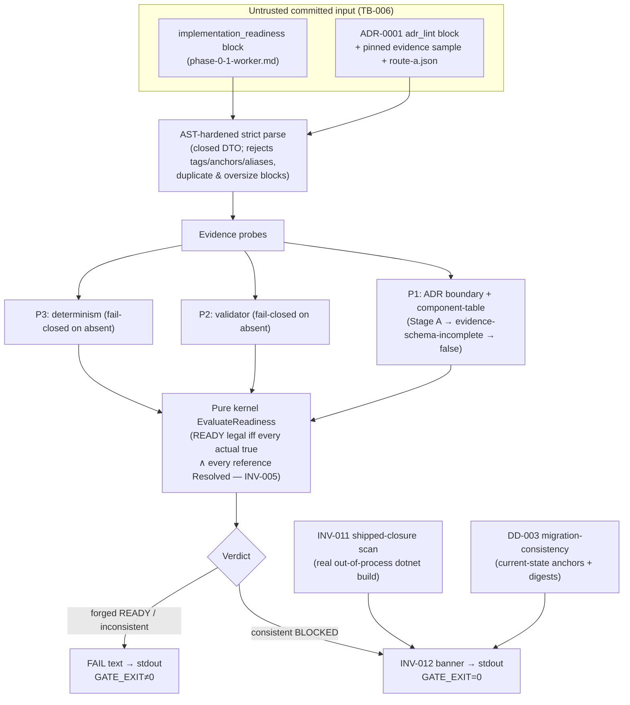

# Feature: Readiness-Gate Carrier (phase-0.1-worker enforcement home)

> **Phase 0.1 enabling infrastructure — Stage A.** Isolated, non-shipped .NET 10
> gate solution under `gate/`. Registers no production code (`src/` stays empty).
>
> - Spec: [`.correctless/specs/readiness-gate-carrier.md`](../../.correctless/specs/readiness-gate-carrier.md) (v11)
> - Verification: [`readiness-gate-carrier-verification.md`](../../.correctless/verification/readiness-gate-carrier-verification.md)
> - Parent spec (what it enforces): [`.correctless/specs/phase-0-1-worker.md`](../../.correctless/specs/phase-0-1-worker.md)
> - Architecture: PAT-005, TB-006, the `readiness-build-gate` entrypoint in [`.correctless/ARCHITECTURE.md`](../../.correctless/ARCHITECTURE.md)

## What this does

The Phase-0.1 worker may not land production code until a machine-readable
`implementation_readiness` block in `phase-0-1-worker.md` says its preconditions
(P1 ADR-boundary, P2 validator, P3 determinism) are genuinely dischargeable. The
danger is trusting that block: anyone with commit access can flip a `satisfied`
flag, forge an ADR claim, or land a `src/` package early. This carrier is the
**fail-closed gate that re-derives the evidence** instead of trusting the flags,
and the **production-surface ban** that keeps `src/` empty while readiness is
`BLOCKED` — the RS-002 unlock the parent worker depends on.

It lives in an **exempt, non-shipped carrier** (`gate/`), *outside* the shipped
compilation closure, so the gate can enforce its own production-code ban without
tripping it (INV-036 self-enforcement; PAT-005). The solution is four projects
aggregated by `gate/Corrected.Gate.slnx`:

| Project | Role |
|---------|------|
| `Corrected.Gate.Kernel` | Pure, **I/O-free** readiness verdict: `EvaluateReadiness((block, probeResults)) → {Pass \| Fail, offending}` + the closed DTOs. No `System.IO`, no clock, no ambient state (INV-004). |
| `Corrected.Gate` | The impure edge: AST-hardened YAML/ADR parsers, the P1/P2/P3 evidence probes, the DD-003 migration-consistency gate, the INV-011 shipped-closure scanner, the INV-012 status renderer. |
| `Corrected.Gate.Tests` | xUnit suite — one `Inv0NN*Tests.cs` per invariant + `ProhibitionsTests.cs`; the SUPPLIED-fixture corpus that drives the pure kernel. |
| `Corrected.Gate.Lint` | Dafny-free ADR linter extracted so the gate build never pulls Dafny assemblies (INV-018 build insulation). |

### Flow



The **INV-011 scanner does a real out-of-process `dotnet build -t:Rebuild`** on
the pinned SDK — running generators (`EmitCompilerGeneratedFiles`), extracting the resolved
`-getItem:Compile` and `-getItem:Analyzer` item sets, and diffing an analyzer
baseline — rather than a
static path/text scan, so a generated or linked source that lands *inside* a
shipped project's built closure is caught. The **DD-003 gate** hashes the bytes
between paired current-state anchors in the parent spec against real SHA-256
digests in `readiness-migration-manifest.json`, and fails closed on a missing or
duplicate anchor, a missing/invalid manifest, or an injected appendix marker.

## How to run it

```bash
bash gate/run-readiness-gate.sh
```

Run from a clean checkout (`git clone` + `rm -rf spikes/dafny-compat/out/`). The
script is the single canonical operator **and** CI command (INV-014/INV-017). It:

1. does a locked (`--locked-mode`) restore under the pinned SDK, then runs
   `dotnet test gate/Corrected.Gate.slnx --logger "trx;LogFileName=gate.trx"`;
2. runs an **out-of-suite** TRX guard that fails on zero-discovery / a
   below-floor executed count (a bare `dotnet test` has no such guard);
3. **always** renders the INV-012 status banner to stdout (PASS-BLOCKED on green,
   FAIL text otherwise);
4. exits `0` **iff** `test_rc == 0 && trx_rc == 0 && render_rc == 0` (the combined
   exit is single-sourced in `gate/tools/combined-exit.sh`).

A recursion sentinel (`CORRECTED_GATE_INNER`) makes any gate-invoking helper
running *inside* the discovered suite a no-op. CI wires the from-clean run via
`.github/workflows/readiness-gate.yml` → `gate/ci/from-clean-gate.sh`.

Current green-from-clean state: **227/227, `GATE_EXIT=0`**, banner on stdout.

## Stage A vs Stage B

The carrier landed as **Stage A** (enforcement home, readiness *not* flipped).
**Stage B has since landed** — the sanctioned P1 flip.

- **Stage A** (carrier): the parent readiness block declared `P1/P2/P3
  satisfied: false`; ADR-0001's machine `status:`/`supersedes` keys were absent, so
  the P1 probe short-circuited to `evidence-schema-incomplete` → a consistent
  `BLOCKED` verdict.
- **Stage B** (landed): ADR-0001 now carries `status: accepted` (+ explicit
  `supersedes: null` / `superseded_by: null` terminal), so the P1 probe re-derives
  COMPATIBLE and `P1.satisfied` is `true`. The DD-003 manifest migrated to its
  after-digests (the A2/B5 anchor spans swapped) atomically with the flip. **P2/P3
  stay `false`, so readiness remains consistently `BLOCKED`** — the flip crossed the
  boundary the carrier exists to gate without ever being a bare edit ahead of
  evidence (a bare flip fails the gate: after-digest mismatch or forged-READY).

## Configuration

- **SDK pin.** Repo-root `global.json` pins SDK `10.0.302` (`rollForward:
  latestPatch`, `allowPrerelease: false`), kept semantically synced with the
  spike's pin (INV-016 / TB-004).
- **Pinned + locked packages** (per-project `packages.lock.json`, `<clear/>`
  `gate/NuGet.Config`, CPM opt-out): `YamlDotNet` 18.1.0 (hardened parse),
  `Microsoft.CodeAnalysis.CSharp` 4.14.0 (syntax scan), `Microsoft.NET.Test.Sdk`
  17.11.1 / `xunit` 2.9.2. No `Microsoft.Build.*` reference — the closure build
  is out-of-process against the pinned SDK's MSBuild (INV-015).

## Known limitations

The carrier ships three **accepted drift-debt residuals** (tracked in
`.correctless/meta/drift-debt.json`). At Stage A they were dormant; **since the
Stage-B P1 flip landed the P1 probe runs in full**, so these paths now execute —
all three remain fail-safe accepted debt (a residual can only produce a
false-FAIL, never a forged READY):

- **DRIFT-001 (INV-004):** kernel purity is a token-text substring scan, not a
  Roslyn semantic-symbol scan — blind to short-name/implicit-using I/O. Kernel is
  pure today; backstopped by a BCL-only project-graph bound + a behavioral
  determinism check.
- **DRIFT-002 (INV-008b):** the Dafny-family check uses `StartsWith("Dafny")`
  prefix discovery rather than exact-set membership. Fail-safe (a rogue `Dafny*`
  name yields a false-FAIL, never a forged READY). Now **active** at Stage B (P1
  no longer short-circuits before clause (b)); it passes because route-a.json's
  loaded-identity set matches.
- **DRIFT-003 (INV-002):** the ADR `adr_lint` block deserializes into
  `Dictionary<string,object?>` rather than a closed DTO. Bounded by Stage-1 AST
  pre-validation (tags/anchors/aliases rejected; only known keys read).

A handful of LOW/informational residuals (crafted `obj/`-Compile evasion,
zero-Compile scan-order, restore `--locked-mode` on future production paths,
temp-cleanup on hard-kill) remain accepted and are catalogued in
`.correctless/artifacts/qa-findings-readiness-gate-carrier.json`.

See the spec for the full INV-001..018 / PRH-001..008 rule set — this doc does
not duplicate it.
